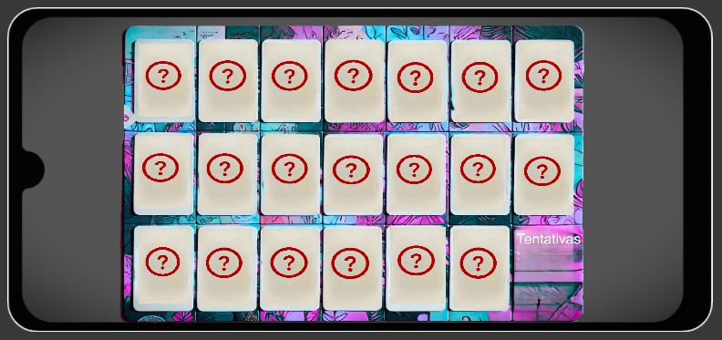
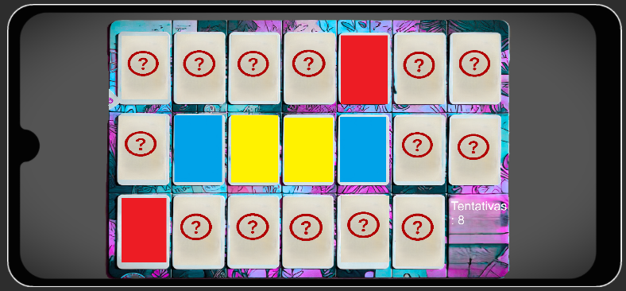
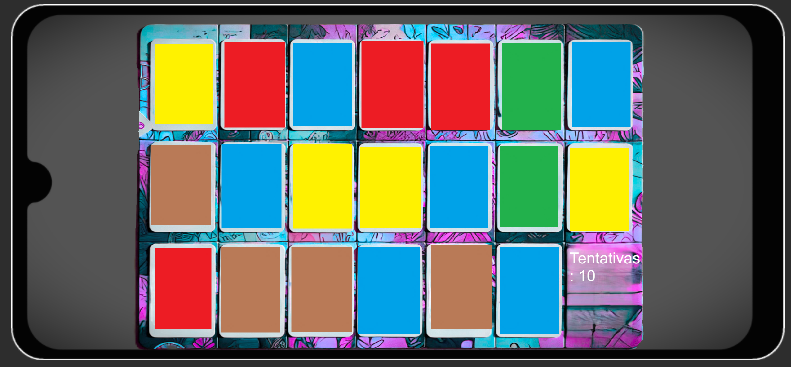

# Jogo-da-memoria

🧠 Jogo da Memória - Unity
Este é um jogo da memória desenvolvido na Unity, utilizando scripts em C#. O projeto foi criado com fins educacionais e está com o código-fonte aberto para que qualquer pessoa possa estudar, modificar ou reutilizar em seus próprios projetos.

🚀 Funcionalidades
Interface simples e intuitiva

Mecânica clássica de jogo da memória

Código modular e comentado para facilitar a compreensão

💡 Uso
Sinta-se à vontade para clonar ou baixar o projeto e adaptá-lo conforme suas necessidades. Ideal para quem está aprendendo Unity ou quer criar jogos com mecânicas simples e divertidas.

📂 Tecnologias utilizadas
Unity Engine

Linguagem C# (C Sharp)

📄 Licença
Código aberto para uso pessoal. Fique à vontade para reutilizar, modificar ou estudar!

# Memory-game

🧠 Memory Game - Unity
This is a memory game developed in Unity, using C# scripts. The project was created for educational purposes and is open source so that anyone can study, modify or reuse it in their own projects.

🚀 Features
Simple and intuitive interface

Classic memory game mechanics

Modular and commented code for easy understanding

💡 Usage
Feel free to clone or download the project and adapt it to your needs. Ideal for those who are learning Unity or want to create games with simple and fun mechanics.

📂 Technologies used
Unity Engine

C# language (C Sharp)

📄 License
Open source for personal use. Feel free to reuse, modify or study!

### Game Img

